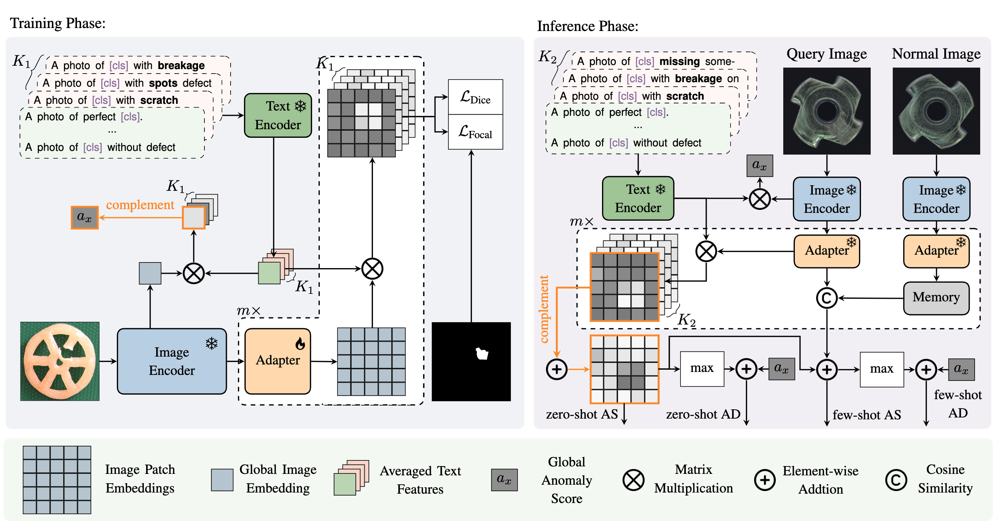

<!-- <p align="center">
  
</p> -->
# MultiADS: Defect-aware Supervision for Multi-type Anomaly Detection and Segmentation in Zero-Shot Learning (ICCV2025)
<div align="center">
<a href="https://arxiv.org/abs/2504.06740"></a>
<a href="https://github.com/boschresearch/MultiADS/stargazers"></a>
<a href="https://github.com/boschresearch/MultiADS/network/members"></a>
<a href="https://github.com/boschresearch/MultiADS/pulls"></a>
<a href="https://github.com/boschresearch/MultiADS/issues"></a>
<a href="https://github.com/boschresearch/MultiADS/blob/main/LICENSE"></a>
</div>

## Purpose of the project
This software is a research prototype, solely developed for and published as part of the publication [MultiADS: Defect-aware Supervision for Multi-type Anomaly Detection and Segmentation in Zero-Shot Learning](https://arxiv.org/abs/2504.06740), which has been accepted by **ICCV 2025**.

## Introduction

We present MultiADS, the first framework that goes beyond binary “good/bad” inspection to detect, localize, and label multiple defect types simultaneously. Here, we propose the first benchmark for the new task of  multi-type anomaly segmentation. Meanwhile, MultiADS also achieves state-of-the-art zero- and few-shot performance across six industrial datasets.


## News
- 12/07/2025: The extension of MultiADS, Defect-aware Hybrid Prompt Optimization (DAPO), is now available at [here](https://www.arxiv.org/abs/2512.09446). 
- 06/25/2025: MultiADS has already been accepted by ICCV2025.

## Installation
### Environment
1. **Clone this repo**  
   ```bash
   git clone https://github.com/boschresearch/MultiADS.git
   cd MultiADS
   ```
2. **Create & activate a conda environment**
    ```bach
    conda env create -f environment.yml
    conda activate MultiADS
    ```
### Datasets
Please download the datasets of MVTec-AD, VisA, MPDD, MAD, and Real-IAD into the data/ folder. Organize them as follows:
```bash
data
├── mvtec
│   └── meta.json
├── visa
│   ├── meta.json
│   └── meta_wo_md.json
├── mpdd
│   └── meta.json
├── MAD_Real
│   └── meta.json
├── MAD_Sim
│   └── meta.json
└── real_iad
    └── meta.json
```
To download our extend visa dataset with segmentation mask for each individual defects. Please visit [VisA_Extended](https://huggingface.co/datasets/zhKingg/VisA_Extended/). Note that in the other datasets, each image contains only **one** type of defect types.

## Training
```bash
python train.py \
  --dataset mvtec  \
  --train_data_path ./data/mvtec  \
  --save_path ./exps/mvtec_default/  
```
- dataset: dataset to use options = {mvtec, visa, mpdd, real_iad}
- train_data_path: where your training images reside  
- save_path  directory to write checkpoints & logs  

## Testing
### Test Binary Anomaly Detection and Segmenation (Zero-shot)
```bash
python test.py \
  --dataset visa \
  --data_path ./data/visa \
  --save_path ./results/visa/zero_shot/ \
  --checkpoint_path ./exps/mvtec/epoch_1.pth 
```
### Test Binary Anomaly Detection and Segmenation (K-shot)
```bash
python test.py \
  --dataset visa \
  --data_path ./data/visa \
  --save_path ./results/visa/few_shot/ \  
  --checkpoint_path ./exps/mvtec/epoch_1.pth \ 
  --k_shot 4 
```
- dataset: dataset to evaluate on
- data_path: path to your VisA test images  
- save_path: where to write K-shot results
- checkpoint_path: which trained weights to load 
- k_shot: few-shot number

### Test Binary Anomaly Detection and Segmentation (Domain Adaption)
```bash
python test_da.py \
  --dataset visa   \
  --data_path ./data/visa \
  --save_path ./results/visa/domain_adption/  \
  --checkpoint_path ./exps/mvtec_default/epoch_1.pth 
```
### Test Multi-type Anomaly Segmentation
```python
python test_multi_defect.py 
    --dataset visa \               
    --data_path ./data/visa \
    --save_path ./results/mvtec_visa_multi_seg/zero_shot/ \
    --checkpoint_path ./exps/mvtec/epoch_1.pth \
```

## Citation
```
@InProceedings{Sadikaj_2025_ICCV,
    author    = {Sadikaj, Ylli and Zhou, Hongkuan and Halilaj, Lavdim and Schmid, Stefan and Staab, Steffen and Plant, Claudia},
    title     = {MultiADS: Defect-aware Supervision for Multi-type Anomaly Detection and Segmentation in Zero-Shot Learning},
    booktitle = {Proceedings of the IEEE/CVF International Conference on Computer Vision (ICCV)},
    month     = {October},
    year      = {2025},
    pages     = {22978-22988}
}
```
